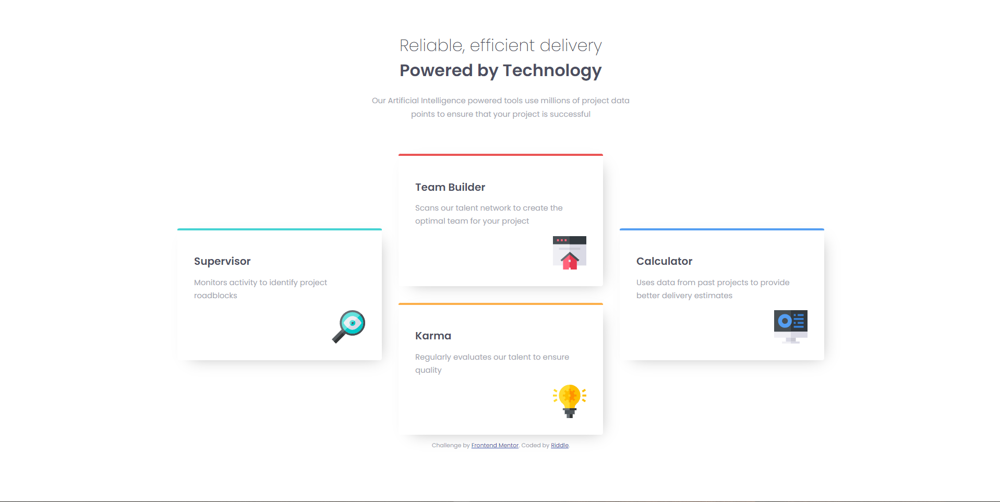
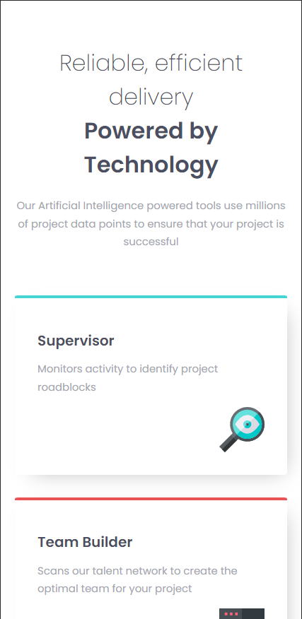

# Frontend Mentor - Four card feature section solution

This is a solution to the [Four card feature section challenge on Frontend Mentor](https://www.frontendmentor.io/challenges/four-card-feature-section-weK1eFYK). Frontend Mentor challenges help you improve your coding skills by building realistic projects. 

## Table of contents

- [Overview](#overview)
  - [The challenge](#the-challenge)
  - [Screenshot](#screenshot)
  - [Links](#links)
- [My process](#my-process)
  - [Built with](#built-with)
  - [What I learned](#what-i-learned)
  - [Continued development](#continued-development)
  - [Useful resources](#useful-resources)
- [Author](#author)
- [Acknowledgments](#acknowledgments)

## Overview

### The challenge

Users should be able to:

- View the optimal layout for the site depending on their device's screen size

### Screenshot

### Links

- Live Site URL: [Vercel](https://four-card-feature-solution-one.vercel.app/)

## My process

### Built with

- HTML
- CSS custom properties
- Flexbox
- CSS Grid

### What I learned

I learnt how to use grid and flexbox

### Continued development

I need to improve more on my understanding of html and css since I'm new and basically just experiment with the tags I see others use.

### Useful resources

- [Kevin Powell](https://www.youtube.com/@KevinPowell) - This youtuber was amazing at teaching everything and very informative + noob friendly 😁

## Author

- Website - [Riddle](https://r-ddle.netlify.app)
- Frontend Mentor - [@r-ddle](https://www.frontendmentor.io/profile/r-ddle)

## Acknowledgments

[@KevinPowell](https://www.youtube.com/@KevinPowell)
